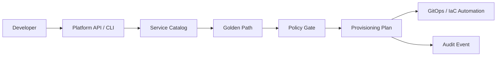

# Platform Engineering Portal

<p align="center"><strong>Developer self-service without giving up platform guardrails.</strong></p>

<p align="center">
<a href="https://github.com/obinna-obika-devops/platform-engineering-portal/actions/workflows/ci.yml"></a>


</p>

An Internal Developer Platform control-plane reference implementation that converts a developer's service request into a validated, deterministic provisioning plan. The design gives application teams a simple API and CLI while keeping runtime standards, environment policy, production approvals and audit context under platform-team control.

## The engineering problem

Developer teams should not need deep knowledge of Terraform modules, Kubernetes manifests, CI configuration and GitOps registration just to start a service. At the same time, exposing unrestricted infrastructure automation creates inconsistent environments, duplicated configuration and weak governance.

This project puts a platform contract between **developer intent** and **infrastructure execution**:

- developers request a supported service and environment;
- the catalog defines approved golden paths;
- validation rejects unsupported combinations early;
- production requests carry an explicit approval boundary;
- the planner creates a repeatable integration contract for downstream automation;
- structured audit metadata makes the request traceable.

## Developer flow



## What was built

| Platform capability | Implementation |
|---|---|
| Developer-facing control plane | [`portal/api.py`](portal/api.py) |
| CLI self-service path | [`portal/cli.py`](portal/cli.py) |
| Service catalog | [`catalog/services.yaml`](catalog/services.yaml) |
| Catalog validation | [`portal/catalog.py`](portal/catalog.py) |
| Deterministic provisioning contract | [`portal/planner.py`](portal/planner.py) |
| Automated quality checks | [`tests/`](tests/) + [GitHub Actions CI](.github/workflows/ci.yml) |

## Platform contract

**Self-service does not mean unrestricted access.** The portal exposes an opinionated path that reduces developer cognitive load while keeping platform policy explicit.

A valid request produces a provisioning plan containing:

- a deterministic plan ID;
- service, runtime and environment context;
- ownership information from the catalog;
- intended repository, CI, Kubernetes and GitOps artifacts;
- policy state and production-approval requirements;
- a structured audit event.

That contract can be consumed by Terraform, GitOps controllers, repository automation or another provisioning service without coupling the developer interface directly to those implementation details.

## Key design decisions

**Catalog before provisioning.** Supported runtimes and environments are defined centrally instead of allowing arbitrary infrastructure requests.

**Separate intent from execution.** The API creates a provisioning contract rather than directly mutating cloud resources. This keeps the control plane testable and makes downstream automation replaceable.

**Deterministic plans.** Equivalent service requests generate stable plan identifiers, making plans easier to correlate, audit and reason about.

**Production is a different trust boundary.** Production requests explicitly require approval rather than treating every environment identically.

**API and CLI share the same platform logic.** Developers can integrate through automation or use a command-line workflow without creating separate policy paths.

## Implemented capabilities

- Service catalog and golden-path selection
- Catalog-backed runtime and environment validation
- Production approval boundary in generated plans
- Deterministic provisioning plan IDs
- Structured artifact intent for repository, CI, Kubernetes and GitOps registration
- Ownership and audit-event metadata
- FastAPI developer interface
- Developer CLI
- Unit tests and automated CI validation

## Technology

| Layer | Stack |
|---|---|
| API | FastAPI / Python |
| Platform model | Service catalog / golden paths |
| Validation | Pydantic + catalog policy |
| Integration | GitOps / IaC provisioning contract |
| Governance | Approval boundaries + audit metadata |
| Quality | Pytest / GitHub Actions |

## Repository map

```text
portal/          API, CLI, catalog validation and provisioning planner
catalog/         approved service definitions and golden-path metadata
tests/           automated behavior and validation tests
.github/         continuous-integration workflow
```

## Quick start

```bash
pip install -r requirements.txt
pytest -q
python -m portal.cli orders python dev
uvicorn portal.api:app --reload
```

The API can then accept developer requests while the CLI provides the same platform workflow from a terminal.

## Operational boundary

This repository intentionally stops at the provisioning-plan boundary. It does **not** directly create cloud resources or modify external repositories. A production implementation could connect the plan to GitOps, Terraform, Azure/AWS/GCP provisioning, repository scaffolding and deployment workflows while retaining the same developer-facing contract.

## Engineering principle

> Make the safe, supported path the easiest path for developers.

The objective is not to hide infrastructure completely. It is to provide useful abstractions that reduce cognitive load while preserving security, governance, ownership and operational responsibility.

## Scope

This is a reference implementation. It demonstrates platform-engineering design and automation without claiming a live enterprise deployment, cloud provisioning, developer adoption or production usage that is not explicitly evidenced in the repository.
