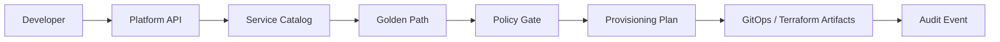

# Platform Engineering Portal

<p align="center"><strong>Self-service infrastructure with guardrails and golden paths.</strong></p>

<p align="center">


</p>

A self-service Internal Developer Platform reference implementation. Developers describe a service request once; the platform validates policy, renders a golden path, and produces artifacts for GitOps/Terraform workflows.

## Developer flow



## Platform contract

**Self-service does not mean unrestricted access.** The portal provides a controlled path from developer intent to infrastructure artifacts while preserving policy and approval boundaries.

## Features

- Service catalog and golden-path templates
- Environment/runtime validation
- Policy-aware provisioning plans
- GitOps and Terraform integration points
- Audit events and approval boundaries
- Developer CLI
- Unit tests + CI

## Technology

| Layer | Stack |
|---|---|
| API | FastAPI / Python |
| Platform | Service catalog / golden paths |
| Infrastructure | Terraform integration |
| Delivery | GitOps integration |
| Governance | Policy gates / approval boundaries |
| Quality | Pytest / GitHub Actions |

## Quick start

```bash
pip install -r requirements.txt
pytest -q
```

No external repositories or cloud accounts are modified automatically by this reference implementation.

## Engineering signal

This project demonstrates the platform-engineering problem beyond deployment: **reduce developer cognitive load without hiding infrastructure, security, governance, or operational responsibilities.**
