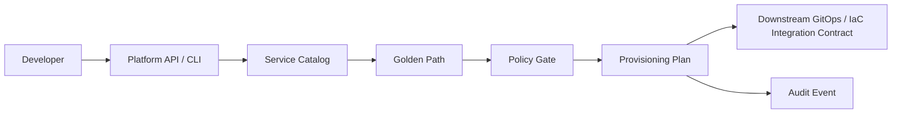

# Platform Engineering Portal

<p align="center"><strong>Self-service service planning with guardrails and golden paths.</strong></p>

<p align="center">
<a href="https://github.com/obinna-obika-devops/platform-engineering-portal/actions/workflows/ci.yml"></a>


</p>

A self-service Internal Developer Platform reference implementation. Developers submit a service request; the platform validates it against an explicit service catalog, applies environment guardrails, and returns a deterministic provisioning plan that can be consumed by downstream GitOps or infrastructure automation.

## Developer flow



## Evidence at a glance

| Engineering concern | Evidence in this repository |
|---|---|
| Developer-facing control plane | [`portal/api.py`](portal/api.py) |
| Golden paths | [`catalog/services.yaml`](catalog/services.yaml) + [`portal/catalog.py`](portal/catalog.py) |
| Guardrails | Catalog-backed runtime/environment validation and production approval boundaries |
| Provisioning contract | [`portal/planner.py`](portal/planner.py) |
| Developer experience | [`portal/cli.py`](portal/cli.py) |
| Quality | [`tests/`](tests/) + [GitHub Actions CI](.github/workflows/ci.yml) |
| Auditability | Deterministic plan IDs and structured audit-event metadata |

## Platform contract

**Self-service does not mean unrestricted access.** The portal provides a controlled path from developer intent to a validated provisioning plan while preserving catalog policy and approval boundaries.

## Implemented features

- Service catalog and golden-path selection
- Catalog-backed environment/runtime validation
- Production approval boundary in generated plans
- Deterministic provisioning plan IDs
- Structured artifact intent for repository, CI, Kubernetes and GitOps registration
- Audit-event metadata in each plan
- Developer CLI and FastAPI interface
- Unit tests and automated CI validation

## Integration boundary

This repository does **not** directly create cloud resources or modify external repositories. The generated provisioning plan is an integration contract for downstream GitOps, Terraform, or other platform automation. Keeping this boundary explicit makes the control plane testable without requiring live cloud credentials.

## Technology

| Layer | Stack |
|---|---|
| API | FastAPI / Python |
| Platform | Service catalog / golden paths |
| Validation | Pydantic + catalog policy |
| Integration | GitOps / IaC provisioning contract |
| Governance | Approval boundaries + audit metadata |
| Quality | Pytest / GitHub Actions |

## Quick start

```bash
pip install -r requirements.txt
pytest -q
python -m portal.cli orders python dev
uvicorn portal.api:app --reload
```

## Design principle

The platform-engineering objective is to **reduce developer cognitive load without hiding infrastructure, security, governance, or operational responsibilities.**

## Scope

This is a reference implementation. It demonstrates platform-engineering design and automation without claiming a live enterprise deployment, cloud provisioning, or production usage that is not explicitly evidenced in the repository.
